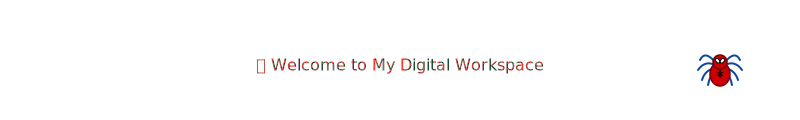

  <a href="https://portfolio-omega-eosin-56.vercel.app"><kbd><b>🌐 Portfolio</b></kbd></a> •
  <a href="https://novustech.in"><kbd><b>🚀 NovusTech.in</b></kbd></a> •
  <a href="mailto:mmidhun781@gmail.com"><kbd><b>✉️ Contact Me</b></kbd></a>

 

<table align="center" width="100%">
  <tr>
    <td width="55%" valign="top">
      <h3>👨💻 Executive Summary</h3>
      
I am a Computer Science Engineer and the <b>Founder of <a href="https://novustech.in">NovusTech.in</a></b>. I specialize in bridging the gap between cutting-edge AI research and robust, secure software architecture.

      <ul>
        <li>🚀 <b>Startup:</b> Bootstrapping innovative tech solutions at NovusTech</li>
        <li>🧠 <b>Focus Areas:</b> Computer Vision, Threat Modeling, Mobile & Web</li>
        <li>🚂 <b>Industry Exp:</b> Signal & Telecom engineering, Southern Railway</li>
        <li>🤝 <b>Leadership:</b> IEDC ASET TECH LEAD (2025-26), COLLEGE UNION GENERAL SECRETARY (2025-26), KBA STUDENT LEAD (2025-26)</li>
      </ul>
      
<i>"I don't just write code — I architect resilient business solutions."</i>

    </td>
    <td width="45%" valign="top">
      <h3>🛠️ Technical Arsenal</h3>
      

        <!-- Animated icons and shields -->
        
          
        
          
        
      

    </td>
  </tr>
</table>

  

### 🔥 Elite Projects Overview

As a founder and developer, my most complex work—including proprietary startup algorithms and medical deep learning models—is housed in private repositories for IP protection. I am always open to discussing architectural decisions and system designs during technical interviews.

| 🏆 Project Name | 📜 Technical Description | 🛠️ Tech Stack | 🔗 Status |
|---|---|---|---|
| **[NovusTech Core Platform](https://novustech.in)** | Enterprise architecture powering the entire NovusTech ecosystem | `Next.js` `Python` `Cloud` | 🔒 *(Private)* |
| **[Hybrid Fracture Detection](#)** | Medical AI using YOLOv5 (localization) & ResNet50 (classification) | `Python` `PyTorch` | 🔒 *(Private)* |
| **[WebApp Security Analyzer](https://github.com/Midhun-M-git/webapp-security-analyzer)** | Custom GUI tool for vulnerability scanning and threat detection | `Python` `Tkinter` | 🌐 Public |
| **[Asthra](https://github.com/Midhun-M-git/asthra)** | AI-driven mobile app automating technical documentation generation | `Flutter` `AI Backend` | 🌐 Public |
| **[Breach Checker Engine](https://github.com/Midhun-M-git/breach-checker-app)** | Secure credential validation engine querying global breach data | `Python` `REST APIs` | 🌐 Public |

  

    

#
## 🏆 Achievements & Impact

  
  
  
  
  

    

  

