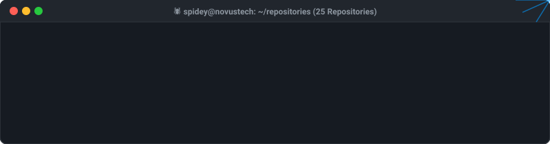

  
  <!-- Custom Header Banner (Spider-Man Theme) -->
  
  
   
  
  <!-- Typing Animation Title (Spider Red) -->
  

  <!-- Text-based social navigation -->
  

    <a href="https://portfolio-omega-eosin-56.vercel.app" target="_blank">Portfolio</a> •
    <a href="https://novustech.in" target="_blank">NovusTech.in</a> •
    <a href="mailto:mmidhun781@gmail.com">Contact Me</a>
  

  

## About Me

I am a Computer Science student and software engineer focusing on building scalable systems, AI/ML integrations, and cybersecurity. 

*   **Education:** Pursuing a Degree in Computer Science
*   **Experience:** Software Intern at **ZENDALONA**
*   **Focus Areas:** Software Development, Software Testing, and Automation
*   **Motto:** *"With great power comes great code."*

---

## Leadership & Impact

*   **Tech Lead** @ IEDC ASET (2025-26) — Driving student innovation and tech projects.
*   **General Secretary** @ College Union (2025-26) — Representing student interest and organizing college events.
*   **Student Lead** @ Kerala Blockchain Academy (KBA) (2025-26) — Promoting web3 and decentralized technology awareness.

---

## Technical Stack & Tools

### Programming Languages & Frameworks

  
  

---

## Projects Overview

  

---

  <!-- Transparent Animated Spider-Man (Adapts to Light & Dark Mode) -->
  

  <!-- Transparent Real Live GitHub Activity Overview Graph (Adapts to Light & Dark Mode) -->
  

  <!-- Transparent Real Live GitHub Streak Stats (Adapts to Light & Dark Mode) -->
  

 

  

