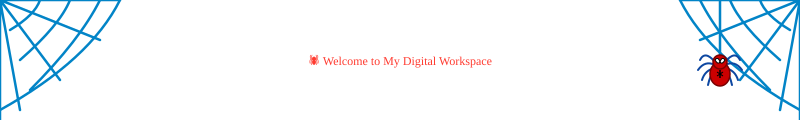

  
  <!-- Custom Header Banner (Spider-Man / Spider Theme) -->
  
  
   
  
  <!-- Typing Animation Title (Spider Red) -->
  

  <!-- Elegant text-based social navigation -->
  

    <a href="https://portfolio-omega-eosin-56.vercel.app" target="_blank">🌐 Portfolio</a> •
    <a href="https://novustech.in" target="_blank">🚀 NovusTech.in</a> •
    <a href="mailto:mmidhun781@gmail.com">✉️ Contact Me</a>
  

  

## 🌌 About Me

I am a Computer Science student and software engineer focusing on building scalable systems, AI/ML integrations, and cybersecurity. I bridge the gap between complex backend logic and seamless, user-centric experiences.

- 🎓 **Education:** Pursuing a Degree in Computer Science
- 💼 **Experience:** Software Intern at **ZENDALONA**
- 🚀 **Philosophy:** *"Building solutions that scale beyond code."*

---

## ⚡ Leadership & Impact

*   **Tech Lead** @ IEDC ASET (2025-26) — *Driving student innovation and tech projects.*
*   **General Secretary** @ College Union (2025-26) — *Representing student interest and organizing college events.*
*   **Student Lead** @ Kerala Blockchain Academy (KBA) (2025-26) — *Promoting web3 and decentralized technology awareness.*

---

## 🛠️ Technical Stack & Tools

### 💻 Programming Languages

  

### ⚙️ Frameworks & Core Technologies

  

---

## 📊 Analytics & Activity

  <table border="0" cellpadding="0" cellspacing="0" style="border: none;">
    <tr style="border: none;">
      <td style="border: none; padding: 10px;">
        
      </td>
      <td style="border: none; padding: 10px;">
        
      </td>
    </tr>
  </table>

 

  

